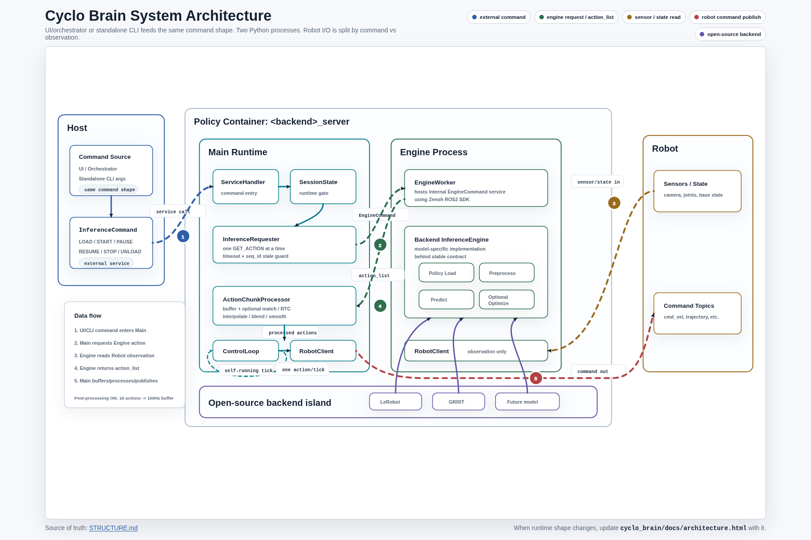
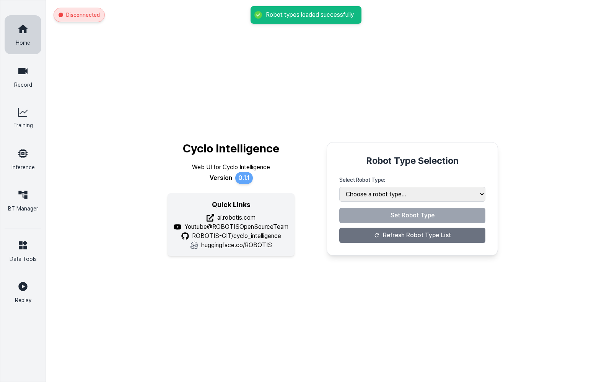
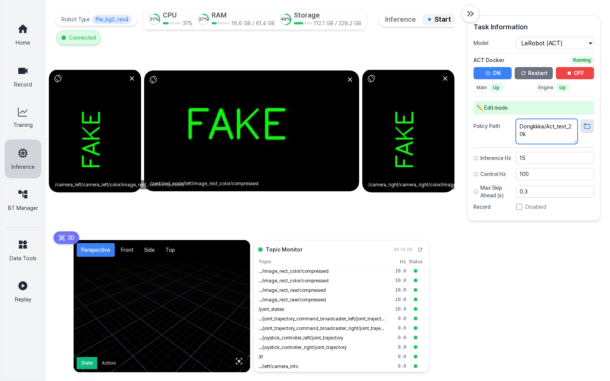
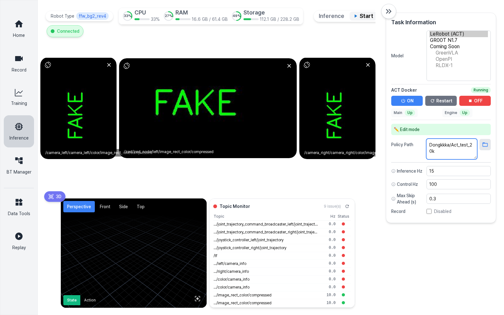
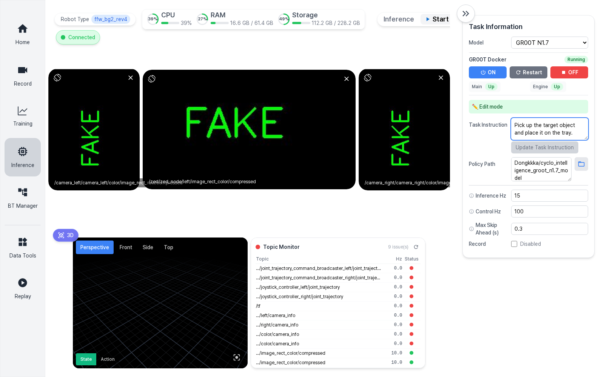

# Cyclo Brain Inference Manual

이 문서는 Cyclo Intelligence UI에서 Cyclo Brain inference를 실행하는 절차를 설명한다. 대상은 이번 개편 이후의 구조다.

- Cyclo Brain policy backend는 `main-runtime`과 `engine-process` 두 Python process로 동작한다.
- UI는 LeRobot ACT와 GR00T N1.7을 하나의 Inference 화면에서 선택한다.
- Docker backend는 UI에서 `ON`, `Restart`, `OFF`로 관리한다.
- 모델은 Hugging Face repo ID 또는 policy checkpoint dropbox 경로로 지정할 수 있다.



## 1. Runtime 구조

Cyclo Brain은 policy container 안에서 두 process를 분리한다.

| Process | 역할 |
| --- | --- |
| `main-runtime` | 외부 inference command를 받는다. session 상태를 관리하고, action chunk buffer에서 action을 하나씩 꺼내 robot command topic으로 publish한다. |
| `engine-process` | policy model을 load하고, robot observation을 읽고, action chunk를 계산한다. robot command는 publish하지 않는다. |

흐름은 다음과 같다.

1. UI 또는 orchestrator가 `LOAD`, `START`, `STOP`, `UNLOAD` 계열 command를 보낸다.
2. `main-runtime`이 command를 받아 session 상태를 갱신한다.
3. `main-runtime`이 내부 Zenoh service로 `engine-process`에 model load 또는 action 계산을 요청한다.
4. `engine-process`가 observation을 읽고 model inference를 실행해 `action_list`를 반환한다.
5. `main-runtime`이 `ActionChunkProcessor`에 action chunk를 넣고, control loop에서 한 tick에 하나씩 publish한다.

이 구조 덕분에 LeRobot과 GR00T는 같은 runtime contract를 공유한다. 다른 점은 engine 내부의 model load, preprocessing, prediction 구현뿐이다.

## 2. UI 접속

로봇에서는 보통 다음 경로에서 실행한다.

```bash
cd /home/robotis/cyclo_intelligence
git pull
./docker/container.sh start
```

브라우저에서 다음 주소로 접속한다.

```text
http://<robot-ip>/
```

로컬에서 보고 있다면 다음 주소를 사용한다.

```text
http://127.0.0.1/
```

처음 접속하면 Home 화면에서 robot type을 먼저 선택한다.



1. `Refresh Robot Type List`로 사용 가능한 robot config를 읽는다.
2. `Select Robot Type`에서 현재 로봇을 선택한다.
3. `Set Robot Type`을 눌러 orchestrator와 policy runtime이 같은 robot config를 쓰도록 한다.
4. 왼쪽 sidebar에서 `Inference`를 누른다.

## 3. Inference 화면 구성



Inference 화면은 크게 네 영역으로 나뉜다.

| 영역 | 설명 |
| --- | --- |
| 좌측 sidebar | Home, Record, Training, Inference, BT Manager, Data Tools, Replay 화면 이동 |
| 상단 상태바 | robot type, ROS 연결 상태, CPU/RAM/Storage 상태, Inference control buttons |
| 중앙 view | camera image, 3D viewer, topic monitor |
| 우측 Task Information | model 선택, Docker backend 제어, policy path, inference/control 설정 |

## 4. Model 선택

`Task Information > Model`에서 사용할 policy backend를 고른다.



현재 실행 가능한 모델은 다음과 같다.

| Model | Backend | 설명 |
| --- | --- | --- |
| `LeRobot (ACT)` | `lerobot_server` | LeRobot ACT checkpoint를 load한다. task instruction은 사용하지 않는다. |
| `GR00T N1.7` | `groot_server` | NVIDIA Isaac GR00T N1.7 checkpoint를 load한다. task instruction을 사용한다. |

다음 항목은 UI에 `Coming Soon`으로 표시된다. 아직 선택할 수 없고, 추후 runtime 검증 후 활성화한다.

- `GreenVLA`
- `OpenPI`
- `RLDX-1`

## 5. Docker Backend Control

Model을 선택하면 우측 패널에 해당 backend Docker control이 나타난다.

| 버튼 | 동작 |
| --- | --- |
| `ON` | policy container가 없으면 local image로 생성/시작한다. container가 멈춰 있으면 다시 시작한다. 이미 running이면 runtime reset을 위해 재시작한다. |
| `Restart` | policy container를 재시작한다. model load 실패, stale service, CUDA memory 정리 후 다시 시도할 때 사용한다. |
| `OFF` | policy container를 stop한다. container와 image는 삭제하지 않는다. |

상태 badge의 의미는 다음과 같다.

| 상태 | 의미 |
| --- | --- |
| `Running` | Docker container가 running 상태다. |
| `Stopped` | container는 있지만 실행 중이 아니다. |
| `Not created` | container가 아직 생성되지 않았다. `ON`을 누르면 local image가 있을 때 생성된다. |
| `Image missing` | 필요한 Docker image가 local에 없다. 먼저 image를 pull하거나 설치해야 한다. |
| `Warming up` | container는 running이지만 runtime process readiness 대기 중이다. |

Process 상태는 두 개가 표시된다.

| Process | `Up` 의미 | `Down` 또는 `Unknown`일 때 |
| --- | --- | --- |
| `Main` | `main-runtime` s6 service가 살아 있다. 외부 inference command와 control loop를 담당한다. | `Restart`를 눌러 backend를 다시 띄운다. |
| `Engine` | `engine-process` s6 service가 살아 있다. model load와 action chunk inference를 담당한다. | model load 또는 inference service가 응답하지 않을 수 있으므로 `Restart`가 우선이다. |

`Main Up`, `Engine Up`은 process 생존 상태다. model이 이미 load되었다는 뜻은 아니다. model load는 `Start`를 누른 뒤 `Policy Path`를 기준으로 별도로 수행된다.

## 6. ACT 모델 실행 플로우

ACT는 LeRobot backend를 사용한다.

1. `Model`을 `LeRobot (ACT)`로 선택한다.
2. `ACT Docker`가 `Running`인지 확인한다.
3. `Main`과 `Engine`이 모두 `Up`인지 확인한다.
4. `Policy Path`에 모델 경로를 입력한다.

예시 Hugging Face repo ID:

```text
Dongkkka/Act_test_20k
```

예시 local checkpoint path:

```text
/policy_checkpoints/lerobot/Act_test_20k
```

5. `Inference Hz`를 모델 action 생성 주기에 맞춘다. ACT 테스트 모델은 보통 `15`를 사용한다.
6. `Control Hz`를 robot command publish 주기에 맞춘다. 기본값은 `100`이다.
7. `Max Skip Ahead (s)`는 chunk aligner가 앞쪽 action을 건너뛸 수 있는 시간 창이다. 기본값 `0.3`부터 시작한다.
8. 상단 `Start` 버튼을 누른다.
9. 상태가 `Loading model...`에서 `Inferencing`으로 바뀌면 action publish가 시작된다.
10. 잠시 멈추려면 `Stop`을 누른다. model은 unload하지 않고 pause/resume 용도로 유지한다.
11. 완전히 종료하고 model과 buffer를 정리하려면 `Clear`를 누른다.

ACT는 task instruction을 쓰지 않으므로 `Task Instruction` 입력창이 표시되지 않는다.

## 7. GR00T N1.7 모델 실행 플로우

GR00T는 GR00T backend를 사용한다.



1. `Model`을 `GR00T N1.7`로 선택한다.
2. `GR00T Docker`가 `Running`인지 확인한다.
3. `Main`과 `Engine`이 모두 `Up`인지 확인한다.
4. `Task Instruction`에 자연어 작업 지시를 입력한다.
5. `Policy Path`에 모델 경로를 입력한다.

예시 Hugging Face repo ID:

```text
Dongkkka/cyclo_intelligence_groot_n1.7_model
```

예시 local checkpoint path:

```text
/policy_checkpoints/groot/cyclo_intelligence_groot_n1.7_model
```

6. `Start`를 누른다.
7. inference 중 task instruction을 바꾸고 싶으면 입력창을 수정한 뒤 `Update Task Instruction`을 누른다.
8. pause는 `Stop`, 완전 정리는 `Clear`를 사용한다.

현재 GR00T N1.7 Docker는 기본적으로 PyTorch eager inference로 실행한다. TensorRT action-head 경로는 별도 검증용이며, UI 기본 실행 경로는 안정성을 우선한다.

## 8. Inference Control Buttons

상단 `Inference` control bar는 모든 backend에서 공통이다.

| 버튼 | 단축키 | 설명 |
| --- | --- | --- |
| `Start` | `Space` | READY 상태에서는 model load 후 inference를 시작한다. PAUSED 상태이고 policy path가 같으면 resume으로 동작한다. |
| `Stop` | `Ctrl+Shift+S` | inference를 pause한다. model은 memory에 유지된다. |
| `Clear` | `Esc` | inference를 종료하고 model, session, action buffer를 정리한다. |
| `Record` | `R` | `Record` checkbox가 enabled일 때 inference 결과를 기록하기 시작한다. |
| `Save` | `R` | recording 중일 때 현재 inference recording을 저장한다. |
| `Discard` | - | recording 중일 때 현재 inference recording을 버린다. |

`Start`가 비활성화되어 있으면 우측 Docker backend 상태를 먼저 본다. 보통 원인은 backend가 `OFF`, `Image missing`, 또는 `Warming up` 상태인 경우다.

## 9. 모델 파일 위치

Docker compose는 host의 checkpoint directory를 policy container 안으로 bind mount한다.

| Backend | Host path | Container path |
| --- | --- | --- |
| LeRobot | `/home/robotis/cyclo_intelligence/cyclo_brain/policy/lerobot/checkpoints` | `/policy_checkpoints/lerobot` |
| GR00T | `/home/robotis/cyclo_intelligence/cyclo_brain/policy/groot/checkpoints` | `/policy_checkpoints/groot` |

따라서 host에 다음처럼 모델을 두면:

```text
/home/robotis/cyclo_intelligence/cyclo_brain/policy/lerobot/checkpoints/Act_test_20k
```

UI에는 다음처럼 입력한다.

```text
/policy_checkpoints/lerobot/Act_test_20k
```

Hugging Face repo ID를 직접 입력할 수도 있다.

```text
Dongkkka/Act_test_20k
Dongkkka/cyclo_intelligence_groot_n1.7_model
```

모델을 미리 다운로드하고 싶으면 각 policy container 안에서 `snapshot_download`를 사용한다.

LeRobot ACT:

```bash
docker exec -it lerobot_server bash
python - <<'PY'
from huggingface_hub import snapshot_download
snapshot_download(
    "Dongkkka/Act_test_20k",
    local_dir="/policy_checkpoints/lerobot/Act_test_20k",
)
PY
```

GR00T N1.7:

```bash
docker exec -it groot_server bash
python - <<'PY'
from huggingface_hub import snapshot_download
snapshot_download(
    "Dongkkka/cyclo_intelligence_groot_n1.7_model",
    local_dir="/policy_checkpoints/groot/cyclo_intelligence_groot_n1.7_model",
)
PY
```

Hugging Face cache는 compose 기준으로 다음 host directory에 남는다.

```text
/home/robotis/cyclo_intelligence/docker/huggingface
```

## 10. Docker image 준비

정상 실행을 위해 local Docker image가 있어야 한다.

LeRobot:

```bash
docker pull robotis/lerobot-zenoh:1.0.0-arm64
```

GR00T:

```bash
docker pull robotis/groot-zenoh:1.2.0-arm64
```

로컬 개발 중 release tag 대신 임시 tag가 있을 수 있다. LeRobot은 `robotis/lerobot-zenoh:arm64`도 local image 후보로 인식한다. GR00T는 release tag `1.2.0-arm64`를 기준으로 맞춘다.

## 11. Troubleshooting

### Start가 눌리지 않는다

우측 backend 상태를 확인한다.

- `Image missing`: Docker image를 pull한다.
- `Stopped` 또는 `Not created`: `ON`을 누른다.
- `Warming up`: `Main`, `Engine`이 `Up`이 될 때까지 기다린다.
- `Main Down` 또는 `Engine Down`: `Restart`를 누른다.

### model load가 실패했다

1. `Policy Path`가 맞는지 확인한다.
2. local path를 쓴다면 container path(`/policy_checkpoints/...`)를 입력했는지 확인한다.
3. Hugging Face repo ID를 쓴다면 network와 token 권한을 확인한다.
4. `Clear`를 눌러 session을 정리한다.
5. 그래도 실패하면 Docker backend `Restart` 후 다시 `Start`한다.

### action이 이상하거나 robot command가 나오지 않는다

1. Topic Monitor에서 camera, joint state, command topic 상태를 확인한다.
2. `Inference Hz`가 학습 데이터 fps와 맞는지 확인한다.
3. `Control Hz`가 robot command publish 주기와 맞는지 확인한다.
4. ACT/GR00T model이 기대하는 camera key와 현재 robot config가 맞는지 확인한다.
5. `Clear` 후 다시 시작한다.

### Docker OFF 후 다시 켜고 싶다

`OFF`는 container를 삭제하지 않는다. 다시 `ON`을 누르면 기존 container를 재사용해 시작한다. 완전히 새 container가 필요하면 CLI에서 compose 또는 docker 명령으로 기존 container를 삭제한 뒤 다시 생성한다.

## 12. 문서 이미지 경로

VitePress로 옮길 때 이 문서가 참조하는 이미지는 다음 위치에 있다.

```text
docs/assets/cyclo-brain-inference/01-home-robot-type.png
docs/assets/cyclo-brain-inference/02-inference-act-setup.png
docs/assets/cyclo-brain-inference/03-inference-model-list-coming-soon.png
docs/assets/cyclo-brain-inference/04-inference-groot-instruction.png
docs/assets/cyclo-brain-inference/05-cyclo-brain-architecture.png
```
